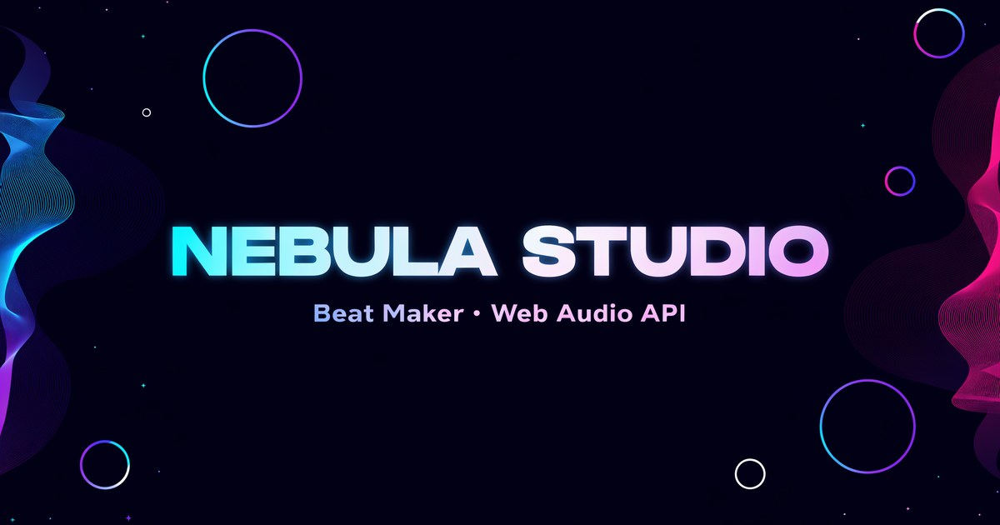

# 🌌 Nebula Studio

**A production-grade, browser-based beat maker and step sequencer built entirely on the Web Audio API.**

Zero dependencies. Zero build step. The audio engine and every UI feature run entirely client-side — the only server-side piece is a small, optional proxy that lets the AI Assistant work out of the box without you needing an API key (see [AI Assistant](#-ai-assistant) below); everything else is pure static files you can open from disk or deploy anywhere.

   

### 🎧 [**Try it live**](https://nebula-studio.shypot.com)



---

## ✨ Features

### 🎚️ Production audio engine
- **12 unique voices** synthesized from scratch — kick, snare, hi-hat, clap, tom, rim, bass (saw + sub), lead (square + vibrato), pad (LFO-filtered chord), pluck, fx-sweep, sub-bass
- **Per-track FX chain** — every track gets its own filter + 3-band EQ + saturation + compressor
- **Master FX** — convolution reverb (procedurally generated impulse), feedback delay, soft-clip limiter
- **Lookahead scheduler** with sample-accurate timing (25 ms tick, 120 ms horizon)
- **Variable swing** (0–60 %)
- Runs entirely on the main thread today (no AudioWorklet yet — a real migration target, not shipped)

### 🎼 Composition
- **16-step sequencer** with 12 tracks
- **Song mode** with 4 pattern slots (A / B / C / D) chained in any order
- **Pattern save / load** with named slots in `localStorage` (10 slots, persists across sessions)
- **Procedural generator (🎲 ROLL)** — deterministic, genre-aware beat generation from a seed. Purely algorithmic, no network call.
- **AI Assistant (✨)** — describe a vibe in your own words; a real LLM call (OpenRouter, works out of the box via a shared free-tier proxy, or bring your own key) picks the genre and seed, then the *same* deterministic generator above builds the actual pattern. See [AI Assistant](#-ai-assistant).
- **Virtual MIDI keyboard** — sustained notes (press-and-hold), full 2-octave computer-key mapping, gated behind an explicit "Keyboard Mode" so it never hijacks other shortcuts
- **Play Along** (Learn tab) — practice mode with a scrolling note timeline and real-time hit detection
- **Chord pad** — one-click chord progressions

### 🎨 Visuals
- **4 visualizer modes** — spectrum, oscilloscope, particle field, nebula clouds
- **Audio-reactive particles** that burst on every hit
- **4 themes** — Cosmic (default), Light, Sunset, Matrix
- **Glassmorphism + aurora background** with smooth animations
- **Fully responsive** — works from 360 px phone to 4K display

### 📚 Learn
- **Built-in tutorial system** with progressive lessons
- **Progress saved per lesson** in `localStorage`
- **Interactive**: highlights relevant UI elements and guides you through real edits

### 💾 Export
- **WAV export** — offline-rendered 16-bit PCM via `OfflineAudioContext` (up to 8 bars)
- **MIDI export** — standard `.mid` files that open in Ableton, FL Studio, Logic, etc.
- **Live recording** — captures the actual output to `.webm`
- **Project share** — encode/decode full session as URL hash for sharing

### ⌨️ Keyboard shortcuts
- `Space` — play / pause
- `C` — clear pattern
- `R` — record
- `E` — export WAV
- `M` — export MIDI
- `Ctrl/Cmd+Z` (`+Shift` for redo) — undo / redo

These are suspended automatically while **Keyboard Mode** is on (Keyboard tab), since at that point the letter keys are playing notes instead:
- `Z X C V B N M` / `S D G H J` — lower octave, white / black keys
- `Q W E R T Y U` / `2 3 5 6 7` — upper octave, white / black keys
- `Escape` (or the on-screen button) — exit Keyboard Mode

---

## 🤖 AI Assistant

Describe a vibe ("dark warehouse rave at 3am") and a real LLM call maps it onto the app's genre vocabulary — the deterministic procedural generator (`ai.js`) then builds the actual pattern from that. The model **never** authors audio, note data, or steps; it only ever picks a value from a closed, validated set (see `AI-NOTES.md` for the full breakdown of this contract, plus its test coverage in `test/ai-assistant.test.js`).

**Two modes, your choice, in Settings (✨ button):**
- **Shared (default, no setup)** — routes through this deployment's own `/api/ai` Worker endpoint, which holds a shared OpenRouter key server-side (a Cloudflare secret, never shipped to the browser) and applies a fair-use rate limit.
- **Bring your own key** — paste an OpenRouter key, stored only in your browser's `localStorage`, calls OpenRouter directly (never touches this app's server), no shared rate limit, and lets you pick a specific model.

If the AI call fails for any reason (rate limit, timeout, a free model having a bad day), the UI automatically falls back to the same deterministic 🎲 roll — clearly labeled as a fallback, never silently pretending the AI call succeeded.

---

## 🚀 Quick start

### Option A — open the file
```bash
git clone https://github.com/veter391/nebula-studio.git
cd nebula-studio
open index.html          # macOS
xdg-open index.html      # Linux
start index.html         # Windows
```
That's it. No `npm install`, no build. The audio engine, sequencer, and every non-AI feature work fine straight from disk. The AI Assistant's default (no-key) mode needs `/api/ai` to actually resolve, so from `file://` it'll fail over to "add your own key" — see [AI Assistant](#-ai-assistant).

> Modern browsers (Chrome / Edge / Firefox / Safari ≥ 14) require a user gesture before audio starts — the boot screen handles this.

### Option B — local dev server (recommended for hot reload)
```bash
npm install
npm run dev              # python3 -m http.server 8080
```
Then visit `http://localhost:8080`. (This serves the static files only — the `/api/ai` proxy isn't running locally this way; see below.)

### Option C — deploy
This repo ships as a **Cloudflare Worker with static assets** (`wrangler.toml` + `worker.js`) — the AI Assistant's shared/default mode (no key needed) only works when deployed this way, since `worker.js` is what hosts the `/api/ai` proxy and holds the shared OpenRouter key as a Cloudflare secret.

```bash
npx wrangler secret put OPENROUTER_KEY   # your own shared key, once
npm run deploy                           # wrangler deploy
```

If you deploy `index.html` + `src/` + `public/` to a plain static host instead (GitHub Pages, Netlify, Vercel, S3) — that works too, but there's no `/api/ai` there, so the AI Assistant only works in **bring-your-own-key** mode (Settings → paste an OpenRouter key). Everything else (the entire audio engine, sequencer, export, Learn tab) is unaffected either way.

---

## 🏗 Architecture

```
nebula-studio/
├── index.html              # single entry, ES module bootstrap
├── README.md
├── LICENSE                 # MIT
├── CHANGELOG.md
├── CONTRIBUTING.md
├── AI-NOTES.md             # what AI/ML practices are actually used here, and where
├── package.json            # dev tooling only (no runtime deps)
├── vitest.config.js
├── wrangler.toml           # Cloudflare Worker config (static assets + AI proxy)
├── worker.js               # the /api/ai proxy — the only server-side code in this repo
├── manifest.json           # PWA manifest
├── sw.js                   # PWA service worker (offline support)
├── .eslintrc.json
├── .prettierrc
├── .gitignore
├── .github/workflows/ci.yml   # lint + test on every push
├── test/                   # Vitest suite — deterministic core + the AI tool-contract
├── public/
│   ├── favicon.svg
│   └── og/og-image-1200x630.jpg
└── src/
    ├── main.js             # app bootstrap
    ├── styles.css          # design tokens + components + themes
    ├── store.js            # central state (pub/sub + localStorage)
    ├── utils.js            # helpers
    ├── ai.js               # deterministic procedural pattern generator
    ├── ai-assistant.js      # AI Assistant — LLM picks params, ai.js does the real work
    ├── core/
    │   ├── engine.js              # AudioEngine (top-level) — also owns recording
    │   ├── voices.js              # 12 synth voices (one-shot + sustained variants)
    │   ├── effects.js             # per-track FX factories
    │   ├── scheduler.js           # lookahead scheduler
    │   ├── wav-encoder.js         # 16-bit PCM WAV writer
    │   ├── midi-export.js         # Standard MIDI File (SMF) writer
    │   └── openrouter-client.js   # BYOK-direct or shared-proxy transport for the AI Assistant
    ├── ui/
    │   ├── shell.js        # header, transport, theme, tabs, toast
    │   ├── sequencer.js    # 16-step grid
    │   ├── mixer.js        # per-track mixer strips
    │   ├── visualizer.js   # canvas visualizer (4 modes)
    │   ├── presets.js      # preset browser + AI Assistant panel
    │   ├── tutorials.js    # interactive lessons
    │   ├── play-along.js   # Learn tab practice mode (note timeline + hit detection)
    │   ├── song.js         # song mode (A/B/C/D + chain)
    │   └── keyboard.js     # virtual MIDI keyboard, sustain, Keyboard Mode, chord pad
    └── data/
        ├── tracks.js       # track definitions
        ├── presets.js      # 24+ genre presets
        ├── songs.js        # Play Along exercise data
        ├── tutorials.js    # lesson content
        └── themes.js       # theme tokens
```

### Audio graph

```
[voice] → [trackGain] → [trackFilter] → [trackEQ] → [trackSat] → [trackComp] ──┐
                                                                              │
                                              ┌────[reverbSend]────[reverb]──┐│
                                              ├────[delaySend]─────[delay]───┤│
                                              │                              ▼▼
                                              │                        [masterGain]
                                              │                              │
                                              │                              ▼
                                              │                       [masterLimiter]
                                              │                              │
                                              │                              ▼
                                              │                         [analyser]
                                              │                              │
                                              │                              ▼
                                              │                        [destination]
                                              │
                                              └──(parallel)──[recorder]──────▶ WebM
```

### State

A single `store.js` module exposes a tiny pub/sub state container. Every UI module subscribes to the slices it cares about (e.g. mixer subscribes to `tracks`, sequencer subscribes to `pattern`). State is persisted to `localStorage` on every change (debounced).

---

## 🧪 Browser support

| Browser | Status |
|---|---|
| Chrome / Edge ≥ 90 | ✅ full support |
| Firefox ≥ 88 | ✅ full support |
| Safari ≥ 14.5 | ✅ full support |
| Mobile Safari iOS 14+ | ✅ touch works everywhere; Keyboard Mode's computer-key input is desktop-only by nature (tapping the on-screen keys still works) |
| Chrome Android | ✅ same caveat as above |

Required Web APIs: `AudioContext`, `OfflineAudioContext`, `AnalyserNode`, `ConvolverNode`, `MediaRecorder`, `MediaStreamDestination`, `localStorage`, `ServiceWorker` (optional, for offline support), ES Modules.

---

## 🤝 Contributing

See [CONTRIBUTING.md](./CONTRIBUTING.md).

---

## 📜 License

MIT © Nebula Studio contributors. See [LICENSE](./LICENSE).

---

## 🙏 Acknowledgements

- Inspired by the workflow of **Ableton Live**, **Logic Pro**, **FL Studio** and the accessibility of **BandLab** / **Soundtrap**
- Built without any external libraries — every oscillator, every filter envelope, every particle is written from scratch
- Star ⭐ the repo if it helped you make something cool